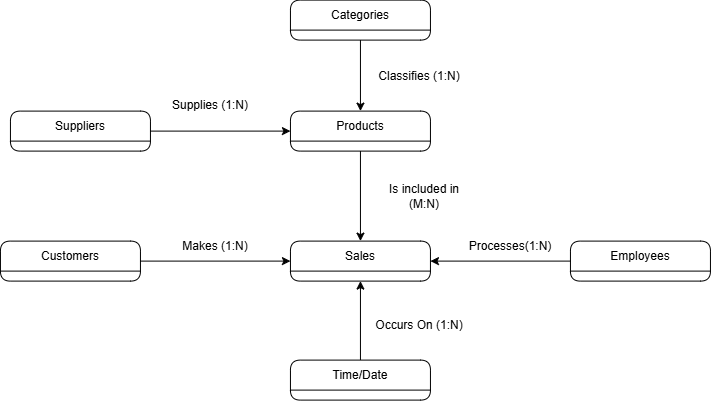
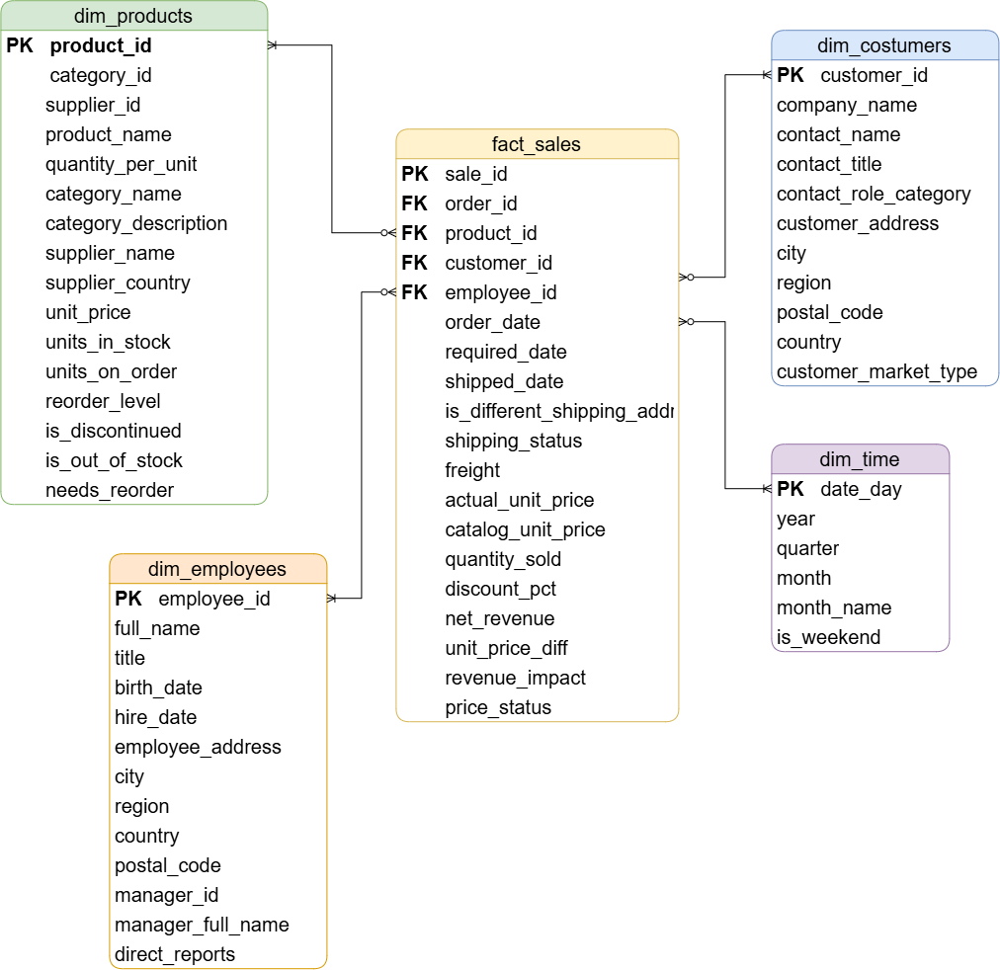

# Data Modeling

## Overview

The Gold layer follows a dimensional model designed to support sales analysis by product, customer, employee, and time.

The central table is `fact_sales`, with one record per order line and product. It is connected to the `dim_products`, `dim_customers`, `dim_employees`, and `dim_time` dimensions.

## Conceptual Data Model

The conceptual model identifies the main business entities:

- **Customers** place sales orders.
- **Employees** process sales orders.
- **Products** are sold through order lines.
- **Categories** classify products.
- **Suppliers** provide products.
- **Time/Date** enables time-based sales analysis.

## Logical Data Model

## Gold Layer Schema

### Fact Table: `fact_sales`

Grain: one row per product included in an order.

| Column | Description |
| --- | --- |
| `sales_id` | Surrogate key for the order-product sales line. |
| `order_id` | Identifier of the sales order. |
| `product_id` | Reference to `dim_products`. |
| `customer_id` | Reference to `dim_customers`. |
| `employee_id` | Reference to `dim_employees`. |
| `order_date` | Date when the order was created. |
| `required_date` | Date requested for the order. |
| `shipped_date` | Date when the order was shipped. |
| `quantity_sold` | Quantity of products sold. |
| `actual_unit_price` | Unit price charged in the order. |
| `discount_pct` | Discount applied to the order line. |
| `net_revenue` | Revenue after discount. |
| `freight` | Shipping cost of the order. |
| `shipping_status` | Status of the shipment. |
| `price_status` | Comparison between actual and catalog price. |

### Dimensions

| Model | Primary Key | Description |
| --- | --- | --- |
| `dim_products` | `product_id` | Product attributes, category, supplier, inventory, and pricing information. |
| `dim_customers` | `customer_id` | Customer company, contact, address, country, and market classification. |
| `dim_employees` | `employee_id` | Employee details, manager hierarchy, and direct-report counts. |
| `dim_time` | `date_key` | Daily calendar with year, quarter, month, week, day, and weekend indicators. |

## Relationships

| Fact Column | Dimension | Dimension Key |
| --- | --- | --- |
| `fact_sales.product_id` | `dim_products` | `product_id` |
| `fact_sales.customer_id` | `dim_customers` | `customer_id` |
| `fact_sales.employee_id` | `dim_employees` | `employee_id` |
| `fact_sales.order_date` | `dim_time` | `date_day` |
| `fact_sales.required_date` | `dim_time` | `date_day` |
| `fact_sales.shipped_date` | `dim_time` | `date_day` |

## Data Quality

The Gold layer applies dbt tests to protect analytical consistency:

- Unique and non-null primary keys for all dimensions and `fact_sales`.
- Referential-integrity tests between `fact_sales` and the dimensions.
- Accepted-value tests for `shipping_status`, `price_status`, `customer_market_type`, and calendar quarters.
- Numeric range tests for prices, quantities, revenue, discounts, inventory, and date components.